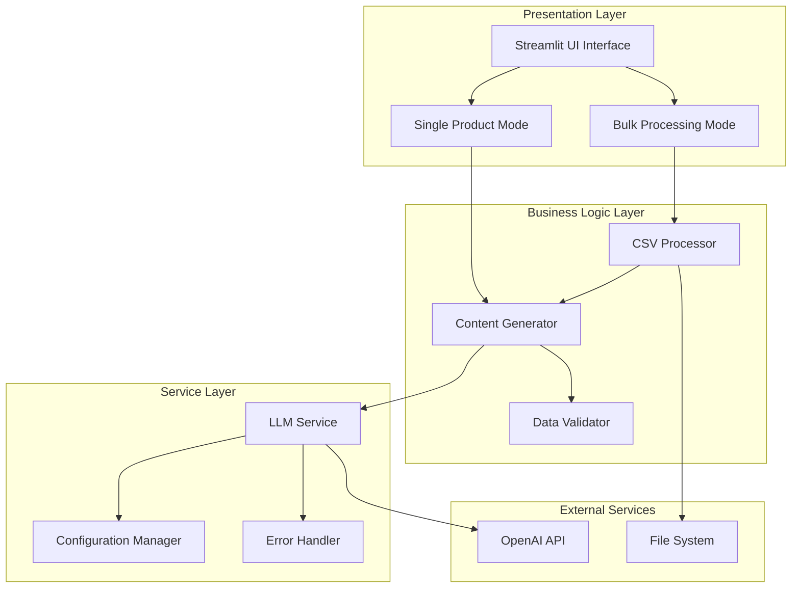

# Design Document: B2B AI E-commerce Content Generator

## Overview

The B2B AI E-commerce Content Generator is a Python-based web application built with Streamlit that automates product listing creation for e-commerce sellers. The system provides both single product and bulk processing capabilities, leveraging OpenAI's GPT-4o model to generate SEO-optimized titles, creative descriptions, and Instagram hashtags.

The application follows a modular architecture with clear separation of concerns, ensuring maintainability, testability, and scalability. Key design principles include graceful error handling, memory-efficient processing for large datasets, and a clean user interface that provides immediate feedback.

## Architecture

The system follows a layered architecture pattern with the following components:



### Key Architectural Decisions

1. **Modular File Structure**: Separate modules for UI, business logic, and services to enable independent testing and maintenance
2. **Stateless Design**: Each request is processed independently to support concurrent users
3. **Streaming Processing**: Use pandas chunking for large CSV files to prevent memory overflow
4. **Retry Logic**: Implement exponential backoff for API calls to handle rate limiting gracefully
5. **Environment-Based Configuration**: Use environment variables for sensitive configuration like API keys

## Components and Interfaces

### UI Interface (`ui.py`)

The Streamlit-based user interface provides two main modes:

**Single Product Mode Interface:**

```python
class SingleProductInterface:
    def render_input_section() -> Dict[str, Any]
    def render_tone_selector() -> str
    def render_results_section(content: ProductContent) -> None
    def handle_image_upload() -> Optional[bytes]
    def handle_text_input() -> Optional[str]
```

**Bulk Processing Mode Interface:**

```python
class BulkProcessingInterface:
    def render_file_upload() -> Optional[BytesIO]
    def render_progress_bar(current: int, total: int) -> None
    def render_download_section(processed_data: pd.DataFrame) -> None
    def validate_csv_structure(df: pd.DataFrame) -> bool
```

### Content Generator (`content_generator.py`)

Core business logic for generating product content:

```python
class ContentGenerator:
    def __init__(self, llm_service: LLMService, validator: DataValidator)

    def generate_single_product_content(
        product_input: ProductInput,
        tone: str
    ) -> ProductContent

    def generate_bulk_content(
        products_df: pd.DataFrame,
        tone: str,
        progress_callback: Callable[[int, int], None]
    ) -> pd.DataFrame

    def _create_prompt(product_info: str, tone: str) -> str
    def _parse_ai_response(response: str) -> ProductContent
```

### LLM Service (`llm_service.py`)

Handles all interactions with the OpenAI API:

```python
class LLMService:
    def __init__(self, config_manager: ConfigurationManager)

    def generate_content(prompt: str) -> str
    def _make_api_call_with_retry(prompt: str, max_retries: int = 3) -> str
    def _handle_rate_limit(retry_count: int) -> float
    def _validate_api_response(response: Any) -> bool
```

### CSV Processor (`csv_processor.py`)

Manages bulk file operations with memory efficiency:

```python
class CSVProcessor:
    def __init__(self, content_generator: ContentGenerator)

    def process_csv_file(
        file_buffer: BytesIO,
        tone: str,
        chunk_size: int = 100
    ) -> pd.DataFrame

    def _process_chunk(
        chunk: pd.DataFrame,
        tone: str
    ) -> pd.DataFrame

    def _merge_results(chunks: List[pd.DataFrame]) -> pd.DataFrame
    def validate_csv_format(df: pd.DataFrame) -> ValidationResult
```

### Utilities (`utils.py`)

Common utilities and helper functions:

```python
class DataValidator:
    def validate_product_input(input_data: Any) -> ValidationResult
    def sanitize_text_input(text: str) -> str
    def validate_file_size(file_buffer: BytesIO) -> bool
    def validate_csv_columns(df: pd.DataFrame) -> List[str]

class ConfigurationManager:
    def load_environment_config() -> Dict[str, str]
    def validate_api_key() -> bool
    def get_openai_client() -> OpenAI

class ErrorHandler:
    def handle_api_error(error: Exception) -> str
    def handle_file_error(error: Exception) -> str
    def log_error(error: Exception, context: str) -> None
```

## Data Models

### Core Data Structures

```python
@dataclass
class ProductInput:
    name: Optional[str] = None
    image_data: Optional[bytes] = None
    additional_attributes: Dict[str, str] = field(default_factory=dict)

@dataclass
class ProductContent:
    title: str
    description: str
    hashtags: List[str]

    def validate(self) -> bool:
        return (
            len(self.title) <= 60 and
            100 <= len(self.description) <= 300 and
            len(self.hashtags) == 5
        )

@dataclass
class ValidationResult:
    is_valid: bool
    errors: List[str]
    warnings: List[str] = field(default_factory=list)

@dataclass
class ProcessingProgress:
    current: int
    total: int
    status: str
    errors: List[str] = field(default_factory=list)
```

### CSV Data Schema

**Input CSV Requirements:**

- Required columns: `product_name`
- Optional columns: `category`, `brand`, `price`, `description_hints`
- Maximum file size: 50MB
- Supported formats: CSV, TSV

**Output CSV Schema:**

- All input columns preserved
- Added columns: `generated_title`, `generated_description`, `generated_hashtags`
- Error tracking: `processing_status`, `error_message`

## Correctness Properties

_A property is a characteristic or behavior that should hold true across all valid executions of a system—essentially, a formal statement about what the system should do. Properties serve as the bridge between human-readable specifications and machine-verifiable correctness guarantees._

Before defining the correctness properties, I need to analyze the acceptance criteria from the requirements document to determine which ones are testable as properties.

### Property 1: Content Format Validation

_For any_ valid product input, generated content should always include a title ≤60 characters, description between 100-300 words, and exactly 5 hashtags
**Validates: Requirements 1.4, 1.5, 1.6**

### Property 2: Input Processing Consistency

_For any_ valid product input (image or text), the Content_Generator should produce structured product content
**Validates: Requirements 1.1, 1.2**

### Property 3: Tone Application

_For any_ product input and selected tone, the generated content should reflect characteristics of the specified tone of voice
**Validates: Requirements 1.3**

### Property 4: CSV Structure Validation

_For any_ uploaded CSV file, the CSV_Processor should validate required columns and data types before processing
**Validates: Requirements 2.1**

### Property 5: Bulk Processing Completeness

_For any_ valid CSV data, the Content_Generator should generate content for each valid product row
**Validates: Requirements 2.2**

### Property 6: Output CSV Format

_For any_ processed CSV data, the output should be a valid CSV with all original columns plus generated content columns
**Validates: Requirements 2.3**

### Property 7: Progress Indication

_For any_ long-running operation, progress callbacks should be invoked to update the UI interface
**Validates: Requirements 2.4**

### Property 8: Error Resilience in Batch Processing

_For any_ CSV data containing both valid and invalid rows, processing should continue for valid rows and log errors for invalid ones
**Validates: Requirements 2.5**

### Property 9: Session State Preservation

_For any_ mode switch operation, relevant user session data should be preserved across UI state changes
**Validates: Requirements 3.2**

### Property 10: Error Message Display

_For any_ error condition, the UI should display user-friendly error messages with actionable guidance
**Validates: Requirements 3.4**

### Property 11: Result Interaction Capabilities

_For any_ generated content, the UI should provide copy, edit, and download functionality
**Validates: Requirements 3.5**

### Property 12: API Model Specification

_For any_ API call, the LLM_Service should use the OpenAI GPT-4o model for content generation
**Validates: Requirements 4.1**

### Property 13: Retry Logic with Exponential Backoff

_For any_ failed API request, the LLM_Service should implement retry attempts with exponentially increasing delays
**Validates: Requirements 4.2**

### Property 14: Tone Instruction Inclusion

_For any_ content generation request with a specified tone, the API prompt should include tone-specific instructions
**Validates: Requirements 4.3**

### Property 15: API Response Validation

_For any_ API response, the LLM_Service should validate the response structure before returning content
**Validates: Requirements 4.4**

### Property 16: Rate Limit Handling

_For any_ rate limit error from the API, the LLM_Service should handle throttling gracefully with appropriate delays
**Validates: Requirements 4.5**

### Property 17: Environment Configuration Loading

_For any_ application startup, the Configuration_Manager should attempt to load API keys from environment variables
**Validates: Requirements 5.1**

### Property 18: Missing Configuration Handling

_For any_ missing required environment variable, the Configuration_Manager should display clear setup instructions
**Validates: Requirements 5.2**

### Property 19: API Key Security

_For any_ logging or error reporting operation, API keys should never be exposed in logs or error messages
**Validates: Requirements 5.3**

### Property 20: Configuration Validation

_For any_ configuration change, the Configuration_Manager should validate settings before applying them
**Validates: Requirements 5.4**

### Property 21: Environment-Specific Configuration

_For any_ deployment environment, the Configuration_Manager should support environment-specific configuration loading
**Validates: Requirements 5.5**

### Property 22: CSV Column and Type Validation

_For any_ CSV file validation, the Data_Validator should check for required columns and validate data types
**Validates: Requirements 6.1**

### Property 23: Input Sanitization

_For any_ product name input, the Data_Validator should sanitize the input to prevent injection attacks
**Validates: Requirements 6.2**

### Property 24: File Upload Restrictions

_For any_ file upload operation, the Data_Validator should enforce size and format restrictions
**Validates: Requirements 6.3**

### Property 25: Specific Error Messages

_For any_ invalid data input, the Data_Validator should provide specific error messages describing the validation failure
**Validates: Requirements 6.4**

### Property 26: Output Data Integrity

_For any_ completed processing operation, the Data_Validator should verify that output data meets integrity requirements
**Validates: Requirements 6.5**

### Property 27: Network Error Retry

_For any_ network error, the Error_Handler should retry operations with appropriate delays between attempts
**Validates: Requirements 7.1**

### Property 28: Quota Exceeded Handling

_For any_ API quota exceeded error, the Error_Handler should inform users and suggest alternative approaches
**Validates: Requirements 7.2**

### Property 29: Partial Result Preservation

_For any_ file processing failure, the Error_Handler should preserve partial results and enable recovery
**Validates: Requirements 7.3**

### Property 30: Detailed Error Logging

_For any_ unexpected error, the Error_Handler should log detailed information for debugging purposes
**Validates: Requirements 7.4**

### Property 31: Seamless Operation Resumption

_For any_ resolved error condition, the Error_Handler should allow users to resume operations without data loss
**Validates: Requirements 7.5**

### Property 32: Memory-Efficient File Processing

_For any_ large file processing operation, the application should use streaming techniques to prevent memory overflow
**Validates: Requirements 8.5**

## Error Handling

The application implements comprehensive error handling across all layers:

### API Error Handling

- **Rate Limiting**: Exponential backoff with jitter (1s, 2s, 4s, 8s delays)
- **Network Errors**: Automatic retry with circuit breaker pattern
- **Invalid Responses**: Response validation and graceful degradation
- **Quota Exceeded**: User notification with usage guidance

### File Processing Errors

- **Invalid CSV Format**: Clear validation messages with column requirements
- **File Size Limits**: 50MB maximum with progress indication for large files
- **Corrupted Data**: Row-level error tracking with partial processing
- **Memory Issues**: Chunked processing with configurable chunk sizes

### User Input Validation

- **XSS Prevention**: Input sanitization for all text fields
- **File Type Validation**: Whitelist approach for allowed file extensions
- **Data Type Validation**: Strong typing with pandas dtype enforcement
- **Business Rule Validation**: Content length and format requirements

### System Error Recovery

- **Session State Management**: Automatic recovery from UI state corruption
- **Partial Result Preservation**: Checkpoint-based processing for bulk operations
- **Graceful Degradation**: Fallback modes when external services are unavailable
- **Error Reporting**: Structured logging with correlation IDs for debugging

## Testing Strategy

The application employs a dual testing approach combining unit tests and property-based tests to ensure comprehensive coverage and correctness validation.

### Property-Based Testing Configuration

**Testing Framework**: Hypothesis (Python property-based testing library)

- **Minimum Iterations**: 100 per property test
- **Shrinking**: Automatic test case minimization on failure
- **Stateful Testing**: For complex UI interaction scenarios
- **Custom Generators**: Domain-specific data generation for products, CSV files, and API responses

**Property Test Implementation**:

- Each correctness property maps to a single property-based test
- Tests tagged with format: **Feature: b2b-ai-ecommerce-content-generator, Property {number}: {property_text}**
- Comprehensive input space coverage through randomized generation
- Edge case discovery through boundary value testing

### Unit Testing Strategy

**Complementary Coverage**:

- **Specific Examples**: Concrete test cases for known edge cases
- **Integration Points**: Component interaction validation
- **Error Conditions**: Specific error scenario testing
- **Mock Integration**: External service simulation for reliable testing

**Testing Pyramid**:

- **Unit Tests (70%)**: Individual component functionality
- **Integration Tests (20%)**: Component interaction and data flow
- **End-to-End Tests (10%)**: Complete user workflow validation

### Test Data Management

**Synthetic Data Generation**:

- Product name generators with realistic e-commerce patterns
- CSV file generators with configurable schemas and error injection
- Image data generators for upload testing
- API response simulators with various success and error scenarios

**Test Environment Configuration**:

- Isolated test environments with mock external dependencies
- Configurable test data sets for different scenarios
- Automated test data cleanup and reset procedures
- Performance benchmarking with controlled test loads

### Continuous Testing Integration

**Automated Test Execution**:

- Pre-commit hooks for fast unit test execution
- CI/CD pipeline integration with full test suite
- Property test execution with extended iteration counts in CI
- Performance regression testing with baseline comparisons

**Test Reporting and Monitoring**:

- Coverage reporting with minimum 90% code coverage requirement
- Property test failure analysis with automatic shrinking reports
- Performance metrics tracking across test runs
- Flaky test detection and quarantine procedures
